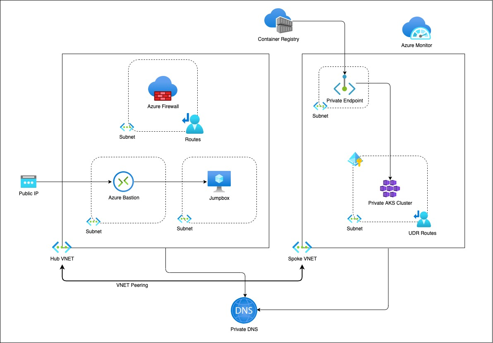

# Create Private AKS Cluster using Bicep

## Overview

This is a blog on how to use modules approach for Infrastructure as Code and be able to provision a Private AKS cluster and few related resources. The bicep modules in the repository are designed keeping Base line architecture in mind. You can start using these modules as is or modify to suit the needs.

## Architecture



## Setup

The bicep modules will provision the following Azure Resources under subscription scope.

1. A Resource Group with Baseline variable
2. Hub VNET with required subnets
   1. Azure Firewall Subnet
   2. Azure Bastion Subnet
   3. A jumpbox subnet
3. Spoke VNET with AKS cluster subnet and additional subnet for other services like Azure Container Registry etc.
4. Azure Firewall and required routes
5. Azure Bastion resource and a jumpbox VM without public IP for securing traffic
6. Azure Container Registry for storing images.
7. A Private Endpoint for ACR
8. Private DNS Zone
9. AAD Enabled, Managed Private AKS Cluster with monitoring Addon and Azure Policy enabled
   1.  Private AK Cluster need the UDR routes enabled via Firewall.

## Resource Provisioning

#### Clone the repo

```bash
git clone https://github.com/ssarwa/bicep
cd bicep
# You could use deploy.azcli as your working file. Don't run the script as is!
```

#### Login to Azure

```bash
az login

az account set -s <Subscription ID>
```

#### Initialize variables

```bash
# Change the variables as required (baseline and location) on deploy.azcli
# Deploy the bicep script
az deployment sub create -n $baseline'Dep' -l $location -f main.bicep
```

The deployment could take somewhere around 20 to 30 mins. Once provisioning is completed you can use the cluster for your needs.

## Next Steps

1. Enable GitOps using Flux operator for Application deployment
2. Enable IaC using CI/CD pipelines on Github Actions
